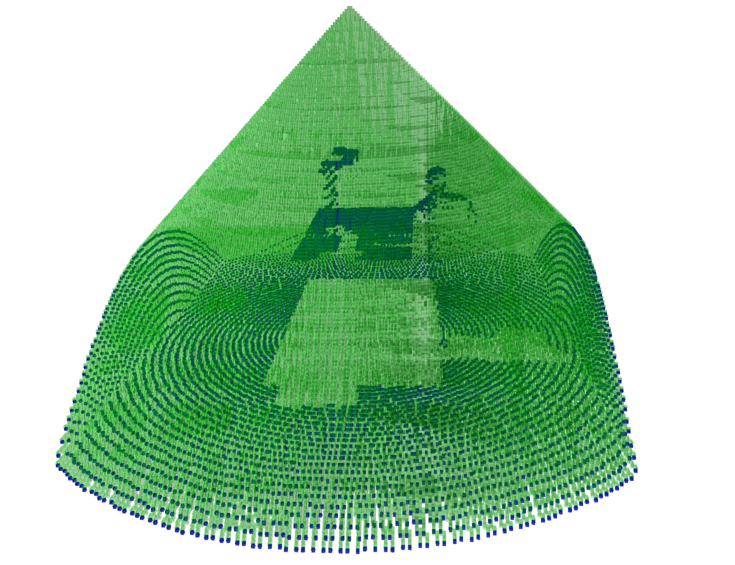

# Perirobot Space

Basic model for Perirobot space simulation.

For a series of sensors it generates occupancy maps and calculates relevant statistics.

## Installation

Older Ubuntu 16.04 might need a downgraded version of `open3d` due to old Glib.

Otherwise just follow the missing python packages (recommended to run in a virtualenv).

Octomap-python should be also installed, see [GitHub Kentaro Project](https://github.com/wkentaro/octomap-python).

## Running
`model_creation.py` - creates model of the robot and human, the models will be added to the `models` folder. 
These models need to be created before the simulation is launched.

`pers.py` - the class with the perirobot space properties.

`run_simulations.py` - code to run the simulation with the set parameters.

`process_data.py` - servers to create LaTeX compliant tables from the results.